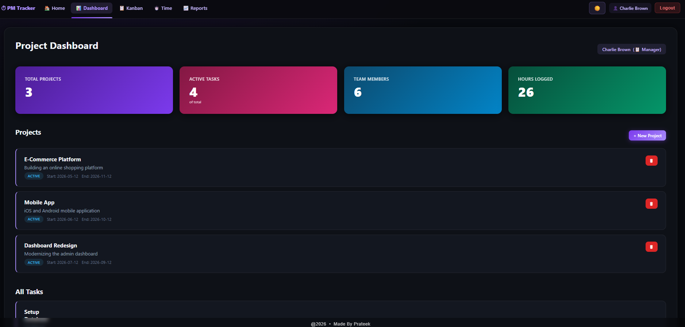
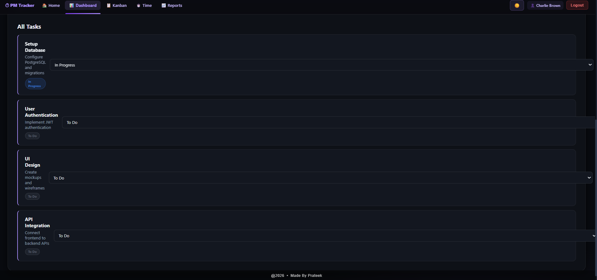
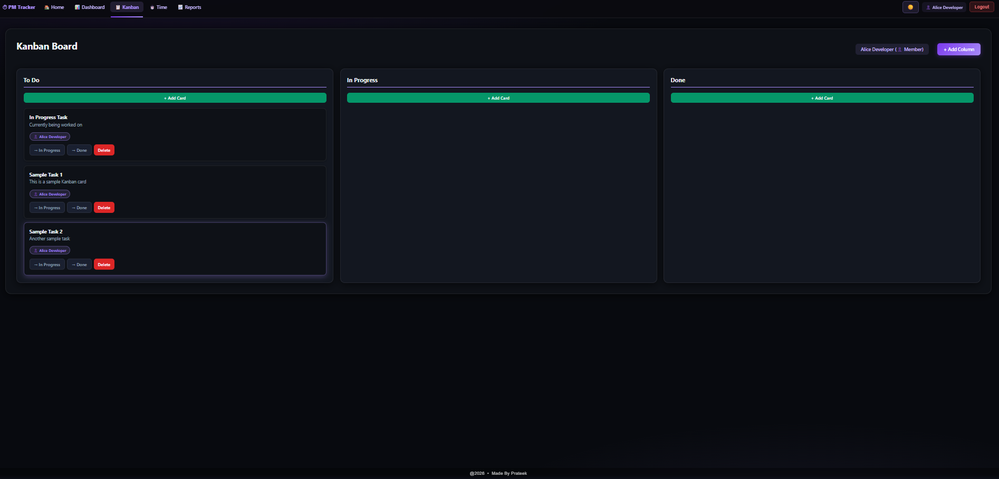
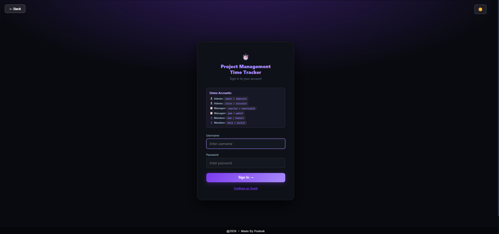
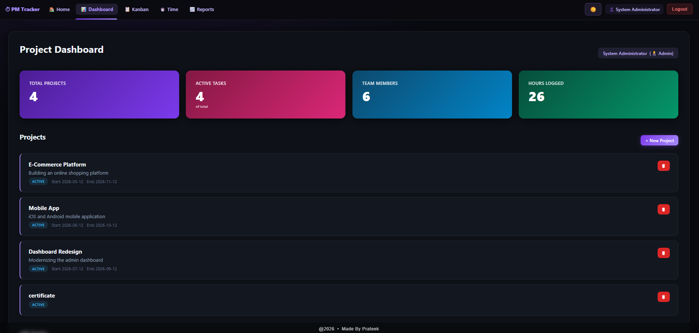
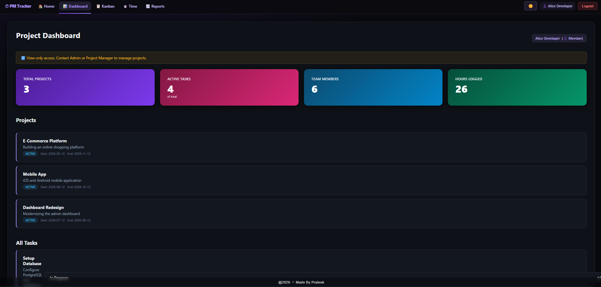
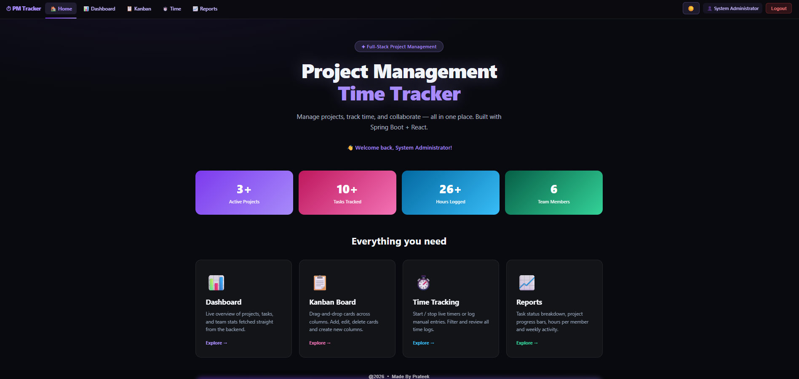
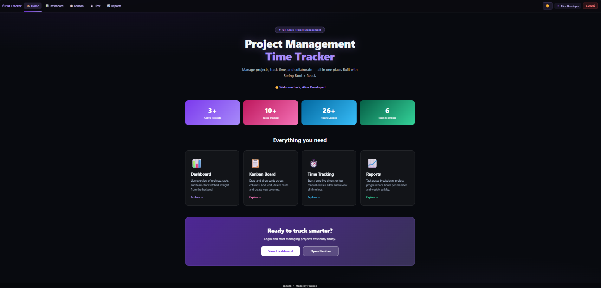

# Project Management Time Tracker ⏱️

A full-stack project management and time tracking web application built with **Spring Boot** (Java) and **React** (TypeScript). Features a Kanban board, live time logging, project dashboards, analytics reports, and role-based access control.

> Made by Prateek &nbsp;|&nbsp; © 2026

---

## Screenshots

### 🏠 Home Page


### 🔐 Login


### 📊 Project Dashboard — Admin View


### 📊 Project Dashboard — Manager View


### 📊 Project Dashboard — Member View (View-only)


### ✅ All Tasks


### 📋 Kanban Board


### 📈 Reports & Analytics


---

## Features

| Feature | Description |
|---------|-------------|
| 🏠 **Home** | Overview with stats, feature cards, and quick navigation |
| 📊 **Dashboard** | Live project/task/team stats fetched from the backend |
| 📋 **Kanban Board** | Drag-and-drop cards across columns; add, edit, delete cards and columns |
| ⏱️ **Time Tracking** | Start/stop live timer or log manual entries; filter and delete logs |
| 📈 **Reports** | Task status breakdown, project progress, hours per member, weekly activity |
| 🔐 **Auth** | Login/logout with session stored in `localStorage`; role-based permissions |
| 🌙 **Theme** | Dark / Light mode toggle, preference persisted in `localStorage` |

### Role-Based Access

| Role | Capabilities |
|------|-------------|
| **Admin** | Full access — manage users, projects, tasks, time logs |
| **Project Manager** | Create and manage projects and tasks; view all reports |
| **Team Member** | Log time, view own logs, update task status |

---

## Tech Stack

### Backend
| Technology | Purpose |
|-----------|---------|
| Java 17 | Language |
| Spring Boot 3.2.9 | REST API framework |
| Spring Data JPA | ORM / database access |
| Spring Security | CORS config, authentication |
| Flyway | Version-controlled DB migrations |
| H2 (dev) | In-memory database, zero setup |
| PostgreSQL (prod) | Production database |
| Spring Boot Actuator | Health & monitoring endpoints |
| Maven | Build tool |

### Frontend
| Technology | Purpose |
|-----------|---------|
| React 18 + TypeScript | UI framework |
| Vite 5 | Dev server and build tool |
| React Router v6 | Client-side routing (SPA) |
| Axios | HTTP client |

---

## Project Structure

```
project-root/
├── src/main/java/com/timetracker/
│   ├── WebApplication.java           # Spring Boot entry point
│   ├── config/
│   │   ├── WebSecurityConfig.java    # Security, CORS, PasswordEncoder
│   │   └── DataLoader.java           # Seeds sample data on startup
│   ├── controller/                   # REST API controllers
│   │   ├── AuthController.java       # /api/auth/*
│   │   ├── DashboardController.java  # /api/dashboard/*
│   │   ├── ProjectController.java    # /api/projects
│   │   ├── TaskController.java       # /api/tasks
│   │   ├── KanbanController.java     # /api/kanban/*
│   │   ├── TimeLogController.java    # /api/timelogs
│   │   ├── TimeEntryController.java  # /api/time-entries
│   │   ├── ReportController.java     # /api/reports/*
│   │   ├── TaskStatusController.java # /api/task-status
│   │   └── HealthController.java     # /api/health
│   ├── model/                        # JPA entities
│   │   ├── User.java, UserRole.java
│   │   ├── Project.java, Task.java
│   │   ├── TimeLog.java, TimeEntry.java
│   │   └── Board.java, KanbanColumn.java, Card.java
│   ├── repository/                   # Spring Data JPA repositories
│   └── service/                      # Business logic layer
│
├── src/main/resources/
│   ├── application.properties        # Base config (active profile: dev)
│   ├── application-dev.properties    # H2 in-memory config
│   ├── application-prod.properties   # PostgreSQL config template
│   └── db/migration/                 # Flyway SQL migration scripts
│
└── frontend/
    ├── src/
    │   ├── App.tsx                   # Root layout, navbar, routes, theme context
    │   ├── main.tsx                  # React entry point
    │   ├── styles.css                # Global CSS
    │   ├── pages/
    │   │   ├── Login.tsx             # Login form
    │   │   ├── Dashboard.tsx         # Stats + project list
    │   │   ├── KanbanNew.tsx         # Kanban drag-and-drop board
    │   │   ├── TimeTracking.tsx      # Timer + manual time entries
    │   │   └── Reports.tsx           # Analytics and charts
    │   └── services/
    │       └── client.ts             # Axios instance (baseURL: /api)
    ├── index.html
    ├── vite.config.ts                # Vite proxy: /api → localhost:8080
    └── package.json
```

---

## Getting Started

### Prerequisites

- **Java 17+**
- **Maven 3.6+**
- **Node.js 18+** and **npm**

### Quick Start (Windows)

Double-click `run.bat` — starts both servers automatically:

```
Backend  → http://localhost:8080
Frontend → http://localhost:5173
```

### Manual Start

**Terminal 1 — Backend:**
```bash
mvn spring-boot:run
```

**Terminal 2 — Frontend:**
```bash
cd frontend
npm install
npm run dev
```

Then open **http://localhost:5173** in your browser.

---

## Demo Accounts

| Username | Password | Role |
|----------|----------|------|
| `admin` | `admin123` | Admin |
| `alice` | `alice123` | Admin |
| `charlie` | `charlie123` | Project Manager |
| `pm1` | `pm123` | Project Manager |
| `bob` | `bob123` | Team Member |
| `dev1` | `dev123` | Team Member |

---

## API Reference

Full API documentation: [`docs/API.md`](docs/API.md)

Quick reference:

| Method | Endpoint | Description |
|--------|----------|-------------|
| `POST` | `/api/auth/login` | Login |
| `POST` | `/api/auth/logout` | Logout |
| `GET` | `/api/dashboard/stats` | Summary stats |
| `GET/POST` | `/api/projects` | List / create projects |
| `GET/POST` | `/api/tasks` | List / create tasks |
| `GET` | `/api/kanban/columns` | Kanban board with cards |
| `POST` | `/api/kanban/cards/{id}/move` | Move card to column |
| `GET/POST` | `/api/timelogs` | List / add time logs |
| `POST` | `/api/time-entries/start` | Start live timer |
| `PUT` | `/api/time-entries/{id}/stop` | Stop live timer |
| `GET` | `/api/reports/dashboard` | Full report stats |
| `GET` | `/actuator/health` | Health check |

---

## Database

The **dev profile** uses an **H2 in-memory database** — no setup needed.  
Sample data is seeded automatically on every startup via `DataLoader.java`:

- 6 users (Admin, Project Manager, Team Member roles)
- 1 Kanban board → 3 columns → 3 sample cards
- 3 projects (E-Commerce Platform, Mobile App, Dashboard Redesign)
- 4 tasks with due dates and hour estimates
- 4 time log entries

### Switch to PostgreSQL (Production)

1. Set the active profile to `prod` in `application.properties`:
   ```properties
   spring.profiles.active=prod
   ```
2. Fill in your database credentials in `application-prod.properties`:
   ```properties
   spring.datasource.url=jdbc:postgresql://localhost:5432/timetracker
   spring.datasource.username=your_user
   spring.datasource.password=your_password
   ```
3. Flyway will run the migration scripts in `db/migration/` automatically.

---

## Future Enhancements

- JWT-based stateless authentication + BCrypt password hashing
- Export reports to PDF / Excel
- Real-time notifications via WebSockets
- User profile management page
- Pagination on list endpoints
- Integration tests with Testcontainers
